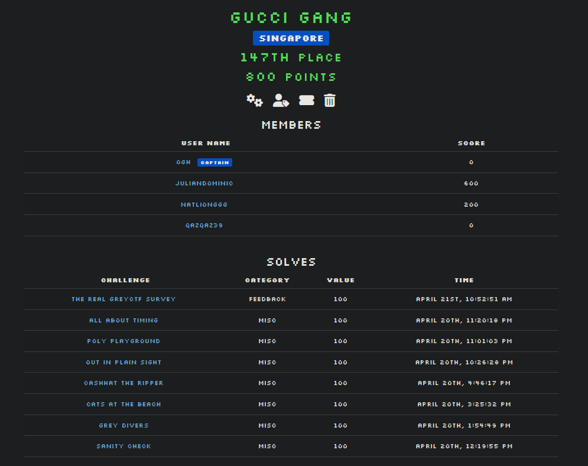
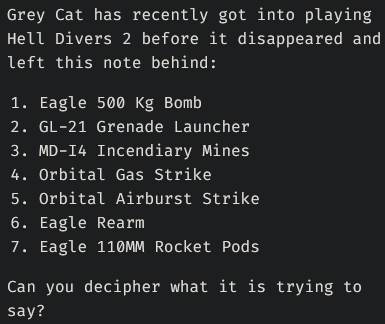
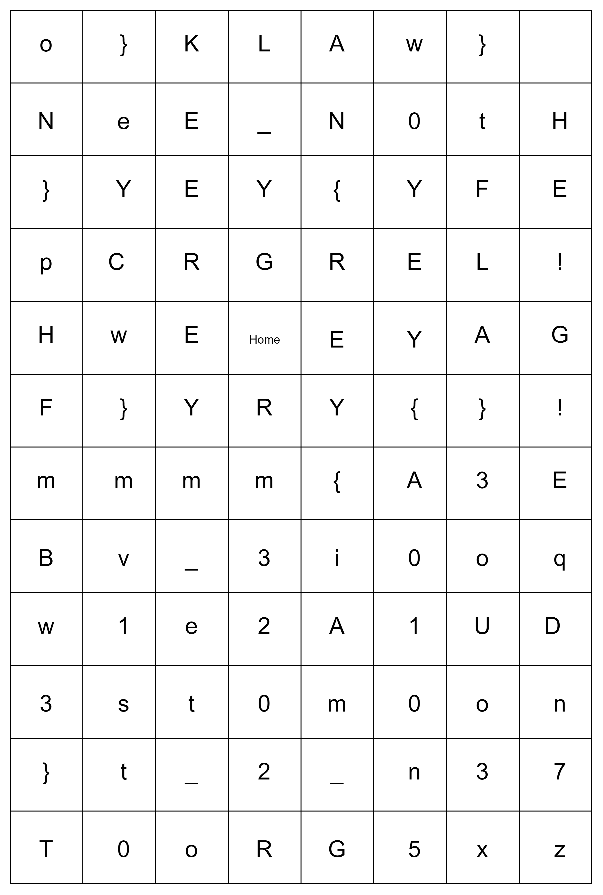
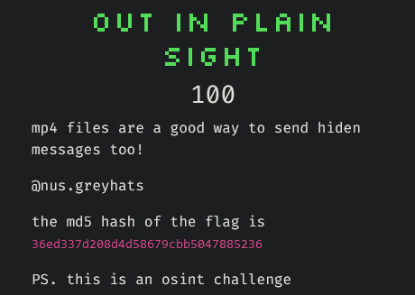
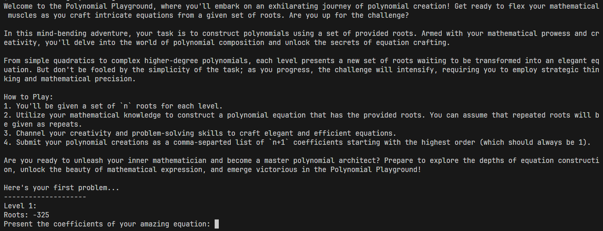

# CTFd NUS Greyhats Apr2024 Qualifiers

- [CTFd NUS Greyhats Apr2024 Qualifiers](#ctfd-nus-greyhats-apr2024-qualifiers)
  - [Challenges](#challenges)
    - [Grey Divers](#grey-divers)
    - [Out In Plain Sight](#out-in-plain-sight)
    - [Poly Playground](#poly-playground)
    - [All About Timing](#all-about-timing)
  - [Closing Thoughts](#closing-thoughts)


Grey Cat The Flag is an annual CTF hosted by NUS Greyhats. Check out the CTF repository [here](https://github.com/NUSGreyhats/greyctf24-challs-public/tree/main).

This was the first ever CTF for my team (Gucci Gang) and I. None of us had prior CTF experience nor the knowledge on how to do a CTF.

We had only heard about the CTF 10 days before and at that point of time, we had zero knowledge about CTFs, and some of us did not even know how to write a single line of code.

Prior to the CTF, we decided to split up our learning based on the different categories -- I chose Cryptography, I grinded CryptoHack courses and had just finished Modular Arithmetic.

At this point, my only knowledge of Cryptography was working with hexadecimal, bytes, encoding, decoding, XOR, quadratic residues, and most importantly FLAGS. Unfortunately, I was not able to solve a single challenge in the Cryptography category.

I would say that we did OK or as expected for a bunch of people with no experience at all.

We were 66th in Singapore (out of 156) and 147th in the world (out of 407).



| Challenge               | Solved By  | Remarks                                              |
| ----------------------- | :--------: | ---------------------------------------------------- |
| Sanity Check            |     Me     | It was free, just join their Discord for the flag    |
| Grey Divers             |     Me     |                                                      |
| Cats At The Beach       | natlionggg |                                                      |
| Cashhat The Ripper      | natlionggg |                                                      |
| Out In Plain Sight      |     Me     |                                                      |
| Poly Playground         |     Me     |                                                      |
| All About Timing        |     Me     |                                                      |
| The REAL GreyCTF Survey |     Me     | Another free, just do a post-CTF survey for the flag |

## Challenges

I will now share how I solved the challenges

### Grey Divers




Hell Divers 2 was given, I have not played it before but I have been seeing memes online that contains arrows related the Hell Divers 2.

Seeing that the grid has "Home" written on it, it was only natural to continue this train of thought.

When we search "Eagle 500 Kg Bomb Hell Divers 2", we can find a wiki page, and on that wiki page, it shows the *strategem code*.

In Hell Divers 2, the *strategem* is the Arrows (up,down,left,right) to execute the action/item. Given that the format of the flag is `grey{FLAG}`, I confirmed my idea with following Eagle 500 Kg Bomb's strategem -- up,right,down,down,down -- which produces `grey{` exactly.

From there, we get the final flag `grey{i3mm_e1w3st_2_n3oU10o3E!}`.

### Out In Plain Sight



`mp4` and a social media handle `@nus.greyhats` was given. A quick search online will show that `@nus.greyhats` only belongs to their instagram page, and all we have to do it just find a video.

The [first video available](https://www.instagram.com/p/C5f-z-PSO5i/) was a video regarding the CTF. I just kept pausing the video non-stop until I spotted a flag which was when they transitioned to the "FLAGS" screen.

The final flag `grey{y0uR_eYeS_aRe_5hArP}`.

### Poly Playground



There were a 100 levels to solve. For each level, we were supposed to find the coefficients of the polynomial that had the roots provided.

I was not aware that there a timeout for the challenge. Instead, I was doing the challenge manually by hand at first and I did not realise it until it was announced in the Discord that a timeout existed. This was a little inconsistent with the rest of the challenges because the rest of the challenges had specified a specific timeout.

I had spent a good 20-30 attempts just typing my answers manually and wondering why the program had suddenly ended even though I had entered the correct answer.

Once I was aware that there was a timeout, I created a simple Python script to solve it using `numpy`'s `poly()` function which finds the coefficients of a polynomial that has the given roots.

``` python
import numpy as np
import socket

def main():
    host = "challs.nusgreyhats.org"
    port = 31113

    with socket.socket(socket.AF_INET, socket.SOCK_STREAM) as s:
        s.connect((host, port))
        while True:
            data = s.recv(4096).decode("utf-8")
            if "grey{" in data:
                print(data)
                break
            roots_line = data.split('\n')[-2]
            roots = [int(i) for i in roots_line.split(':')[1].strip().split(',')]
            coefficients = np.poly(roots)
            answer = ",".join([str(int(i)) for i in coefficients])
            print("coeff:", answer)
            s.sendall(answer.encode("utf-8") + b"\n")

if __name__ == "__main__":
    main()

```

The final flag `grey{l0oks_lik3_sOm3one_c4n_b3_a_po1ynomia1_w1z4rd}`.

### All About Timing

The server was running the following code:

``` python
import time
import random

random.seed(int(time.time()))

print("Guess the number I'm thinking of? It's all about the timing")
x = input("Your guess:")

n = random.randint(1000000000000000, 10000000000000000-1)

if int(x) == n:
    with open("flag.txt") as f:
        print(f.readline())
else: 
    print(f"Wrong answer! The number I was thinking of was {n}\nRemember it's all about the timing!")
```

From here, it may seem impossible to guess the number. The only way that we can guess it is to have the same `time.time()` so that we will have the same number.

However, I did not know how to do that nor did that occur to me immediately. I was just running the above code and calling the challenge at the same time -- `python3 solve.py && nc challs.nusgreyhats.org 31111`. Unfortunately, this did not work.

I created a simple script to just keep guesses to the server.

``` python
import socket
import time
import random

def guess_number():
    random.seed(int(time.time()))
    n = random.randint(1000000000000000, 10000000000000000-1)
    return n

def main():
    host = "challs.nusgreyhats.org"
    port = 31111

    while True:
        with socket.socket(socket.AF_INET, socket.SOCK_STREAM) as s:
            s.connect((host, port))
            guess = str(guess_number())
            print("Sending guess: " + guess)
            s.sendall(guess.encode("utf-8") + b"\n")
            data = s.recv(2048).decode("utf-8")
            print(data)
            if "grey{" in data:
                print(data)
                break
            
if __name__ == "__main__":
    main()

```

After a while, I started to notice that my guesses were **ahead** of the server's guess by about 1 or 2.


I realised that I needed to "slow down"/delay my guess. From here, it was just tweaking `random.seed(int(time.time() + x))` where I played around with `x = 0.1, x = 0.25, x = 0.5, x = 1, x = 1.1`. `x=1.1` is where I managed to successfully match up with server and obtained the flag.

The final flag `grey{t1m3_i5_a_s0c1al_coNstRucT}`.

## Closing Thoughts

This has been an eye-opening experience to the different types of problems and challenges that are available.

This has been an excellent mental exercise to kickstart my brain for my upcoming university education.

I hope to participate in more CTFs in the future and I will continue to learn more about Cryptography so that I can finally sovle a challenge in the Cryptography category!
